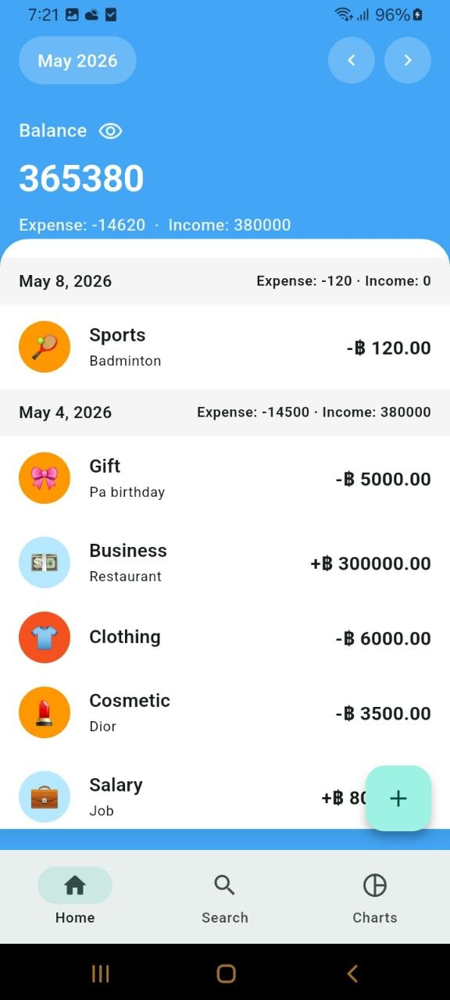
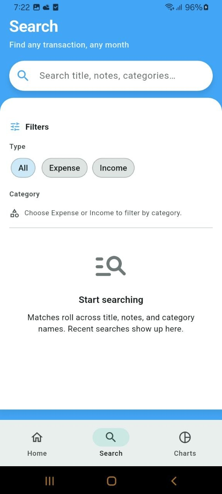
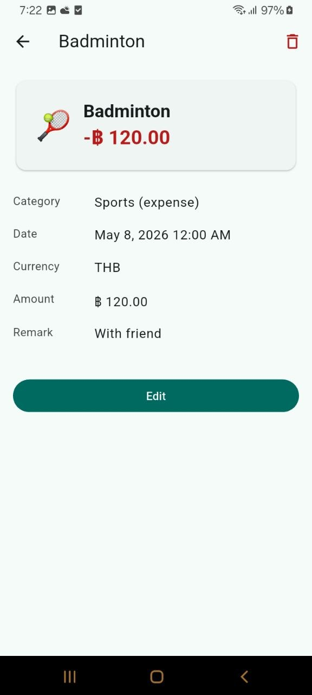

# Personal Expense Tracker

A Flutter app to record expenses and income, browse transactions by day and month, search the ledger, and view category breakdown charts. Data is stored locally with **Hive**.

Screenshots live in **`docs/screenshots/`** (JPEG files below).

---

## Tech stack

| Area | Packages / patterns |
|------|---------------------|
| UI | Flutter (Material 3) |
| State | `flutter_bloc` |
| Local DB | `hive` / `hive_flutter` |
| Charts | `fl_chart` |
| Utilities | `intl`, `equatable` |

Architecture follows a simple layered layout: **domain** (entities, repository contracts), **data** (Hive models, mappers, repository implementation), **presentation** (pages, widgets, blocs), and **core** (theme, routing helpers, shared widgets).

---

## Getting started

```bash
flutter pub get
flutter run
```

---

## Screens (with screenshots)

### Splash screen (`SplashScreen`)

Animated intro on a light blue background: wallet icon, **Expense Tracker** title and subtitle, then transition into the main app.


---

### Home — Transactions list (`TransactionsListPage`)

Transactions grouped **by day** with headers, **month navigation**, calendar-style picking, optional **day filter**, and a summary area where balance visibility can be toggled. Opens **add transaction** and **detail** from rows.

**Default list**



**Balance hidden**


**Calendar / specific day selection**


**Filtered by selected date**


---

### Search (`TransactionSearchPage`)

Search titles, notes, and categories; filters and history. Results grouped by day.

**Search field & filters**



**Search results**


---

### Charts (`ChartsPage`)

Donut chart by category for the focused month, with **expense** vs **income** views.

**Expense breakdown**


**Income breakdown**


---

### Add / edit transaction (`AddTransactionPage`)

Expense vs income, emoji categories / tabs, custom keypad, currency and date, title and note. Four captures below walk through the create/edit UI (`create(1)` … `create(4)`).


---

### Transaction detail (`TransactionDetailPage`)

Large summary card (emoji, title, signed amount), full-field breakdown, **Edit** and **Delete**.



---

## Testing

The project includes **unit tests** (`AmountInputBuffer`, fake repository) and **widget tests** (splash, bottom navigation, search tab).

Run all tests:

```bash
flutter test
```

Run individual files:

```bash
flutter test test/widget_test.dart
flutter test test/amount_input_buffer_test.dart
flutter test test/fake_transaction_repository_test.dart
```

---

## License

This project is for personal .
